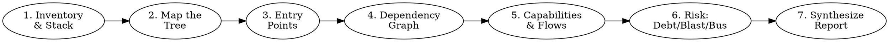

# Project X-Ray

## Overview

Most code assistants explain one file at a time. **Project X-Ray builds a mental model of the whole system first**, then drills into implementation details.

Core principle: **Don't explain files. Explain the system.**

The output is a structured onboarding report that lets a new engineer answer:

- What does this system do?
- How does a request flow through it?
- Which modules are critical, and which are risky to touch?
- Where does the core business logic live?
- Where should I start contributing?

## When to Use

- You just inherited a repository and have no context.
- You're reviewing a codebase before a refactor, audit, or acquisition.
- You're writing onboarding docs for new team members.
- You need a blast-radius / bus-factor read before a risky change.

**Not for:** explaining a single function, answering a one-file question, or generating end-user product docs. Use normal tools for those.

## The Iron Rule: Evidence, Not Guesses

Every claim in the report MUST be backed by something you actually observed in the repo — a file path, a manifest entry, an import graph, a git statistic. If you can't cite it, mark it **Unknown** or attach a confidence level. Hallucinating an architecture is worse than admitting uncertainty.

| Red flag (you're guessing) | Fix |
|---|---|
| Naming a framework not in any manifest | Grep the dependency files first |
| "Probably uses a layered architecture" | Show the directory evidence and a confidence % |
| Listing capabilities from the project name | Derive them from routes/controllers/services |
| Bus factor with no git data | Run `git shortlog`/`git log` or mark Unknown |

## Workflow

Work the phases in order. Each phase feeds the next; don't jump to the report until you've gathered evidence.

1. **Inventory & stack detection** — Read dependency manifests, lockfiles, Dockerfiles, CI configs, and the README. Detect languages, frameworks, infra, and external services from *evidence*, not vibes.
2. **Map the tree** — Walk the directory structure. Identify top-level modules and candidate layers (controllers / services / repositories / models).
3. **Entry points** — Locate where execution starts and reconstruct the startup sequence.
4. **Dependency graph** — Build an import/reference graph. Find the most-referenced modules and the high-coupling hotspots.
5. **Capabilities & flows** — Infer business capabilities from route/controller/service names; trace 2–3 critical end-to-end flows with real file paths.
6. **Risk analysis** — Assess technical debt, blast radius of key files, and bus factor (use git history).
7. **Synthesize** — Fill in the report template. Rank, score, and recommend a learning roadmap.

**How to run each phase:** see [references/investigation-playbook.md](references/investigation-playbook.md) for the concrete commands and search patterns (works for Python, JS/TS, Java, Go, and more).

**How to classify what you find:** see [references/detection-heuristics.md](references/detection-heuristics.md) for architecture-pattern detection, coupling thresholds, debt smells, and scoring rubrics.

**What the output looks like:** fill in [references/report-template.md](references/report-template.md) — the full 15-section onboarding report.

## Quick Reference

| Phase | You produce | Key signal |
|---|---|---|
| Inventory | Tech stack table | `package.json`, `pyproject.toml`, `pom.xml`, `go.mod`, `Dockerfile` |
| Tree map | Module list + layers | Directory naming, folder depth |
| Entry points | Startup sequence | `main`, `app`, `server`, `index`, `Application` |
| Dependencies | Most-referenced + hotspots | Import/reference counts |
| Capabilities | Capability map + core flows | Route/controller/service names |
| Risk | Debt + blast radius + bus factor | God objects, churn, author concentration |
| Report | 15-section onboarding doc | Health score, roadmap, open questions |

## Common Mistakes

- **Starting the report before gathering evidence.** Do all six investigation phases first.
- **Treating file size as importance.** A 3,000-line file may be generated; a 40-line `auth_service` may be the keystone. Rank by *references × change-impact*, not lines.
- **Reporting a single confident architecture.** Real codebases are hybrids. Give the dominant pattern + confidence + the deviations you saw.
- **Skipping git.** Bus factor and blast radius come from history (churn, authors), not from reading code alone.
- **Over-long report for a tiny repo.** Scale the depth to the codebase; a 5-file script doesn't need 15 sections.

## Real-World Impact

A good X-Ray turns "I have no idea where to start" into a ranked reading list, a map of the 5 files that matter, and a short list of the questions worth asking the team on day one.
